# Voice-to-Claude-Code Workflow

**Created:** 4 January 2026
**Location:** Da Nang Beach, Vietnam

---

## The Magic

Sitting by the ocean, watching waves crash on Da Nang beach. No keyboard. No mouse. Just voice.

**Before:** Click, click, click. Rename file. Move folder. Delete. Repeat 500 times.

**Now:** Just talk.

---

## How It Works

```mermaid
flowchart LR
    subgraph INPUT["🎤 Input"]
        A[🗣️ Voice] --> B[🎧 Whisper AI]
    end

    subgraph PROCESS["⚡ Processing"]
        B --> C[📋 Clipboard]
        C --> D[⌨️ Cmd+V]
        D --> E[🤖 Claude Code]
    end

    subgraph APIS["🔌 Google APIs"]
        E --> F{Router}
        F --> G[📧 Gmail API]
        F --> H[📁 Drive API]
    end

    subgraph GMAIL["📧 Gmail Actions"]
        G --> G1[Search]
        G --> G2[Label]
        G --> G3[Archive]
        G --> G4[Trash]
        G --> G5[Download]
    end

    subgraph DRIVE["📁 Drive Actions"]
        H --> H1[List]
        H --> H2[Move]
        H --> H3[Rename]
        H --> H4[Delete]
        H --> H5[Download]
    end

    subgraph OUTPUT["✅ Results"]
        G1 & G2 & G3 & G4 & G5 --> I[📊 Email Organized]
        H1 & H2 & H3 & H4 & H5 --> J[🗂️ Files Organized]
        I & J --> K[🎉 Done!]
    end

    style INPUT fill:#e1f5fe,stroke:#01579b
    style PROCESS fill:#fff3e0,stroke:#e65100
    style APIS fill:#f3e5f5,stroke:#7b1fa2
    style GMAIL fill:#e8f5e9,stroke:#2e7d32
    style DRIVE fill:#e3f2fd,stroke:#1565c0
    style OUTPUT fill:#f1f8e9,stroke:#558b2f
```

```mermaid
flowchart TB
    subgraph TODAY["📅 Today's Session - Da Nang Beach"]
        direction LR
        T1["🏖️ Sitting at beach"] --> T2["🗣️ Voice commands"]
        T2 --> T3["🤖 Claude executes"]
        T3 --> T4["✨ Magic happens"]
    end

    subgraph BEFORE["❌ Before"]
        B1[77 folders at root]
        B2[Manual clicking]
        B3[Hours of work]
        B4[Repetitive strain]
    end

    subgraph AFTER["✅ After"]
        A1[17 organized folders]
        A2[Voice commands]
        A3[Minutes of talking]
        A4[Relaxing on beach]
    end

    BEFORE --> TODAY --> AFTER

    style TODAY fill:#fff9c4,stroke:#f57f17
    style BEFORE fill:#ffebee,stroke:#c62828
    style AFTER fill:#e8f5e9,stroke:#2e7d32
```

### Step by Step

1. **Speak** - Talk naturally about what you want to organize
2. **Whisper** - Real-time transcription captures your words
3. **Clipboard** - Script automatically copies transcription
4. **Cmd+V** - Paste directly into Claude Code terminal
5. **Claude Code** - Has access to Gmail API + Google Drive API
6. **Execution** - Files renamed, moved, deleted, organized

---

## What Claude Code Can Do

### Gmail API
- Search and filter emails
- Trash spam and marketing
- Label and archive by category
- Mark as read
- Download attachments
- Export emails as HTML

### Google Drive API
- List all files and folders
- Search by name
- Create folders
- Move files between folders
- Rename files and folders
- Delete files
- Download files to local machine

---

## Example Session

**Voice input:**
> "Move all the student folders like Trần Đình Thành and Thảo Lưu into Thi IELTS folder. Then download the bank statements to important-docs. Delete the audio folder, it only has 3 files. Clean up images - keep only the GA photos and delete the rest."

**Result:**
- 41 student folders → Thi IELTS
- 6 bank statements → downloaded locally
- Audio folder → deleted
- 519 images → deleted, 7 kept

All done while watching the sunset.

---

## Setup

### Required Tools
- `transcribe-menubar.sh` - Voice transcription app
- `gmail_tool.py` - Gmail + Drive API interface
- Claude Code CLI with MCP or direct API access

### APIs Enabled
- Gmail API (read, modify, send)
- Google Drive API (full access)

### Credentials
- OAuth 2.0 desktop app credentials
- Token auto-refreshes

---

## The Transformation

| Before | After |
|--------|-------|
| 77 root folders | 20 organized folders |
| Manual clicking | Voice commands |
| Hours of work | Minutes of talking |
| Repetitive strain | Relaxing on beach |

---

## Philosophy

> "The best interface is no interface."

Voice + AI + APIs = Magic

You describe what you want in natural language. The AI understands context, handles edge cases, asks clarifying questions when needed, and executes hundreds of operations autonomously.

This is the future of personal computing.

---

## Drive Organization Achieved

| Folder | Purpose |
|--------|---------|
| Thi IELTS | 50+ student folders, teaching materials |
| ARTification | W3 Gallery, art exhibitions, public art |
| University of Greenwich (Vietnam) | QLSK, academic docs |
| ACCA | Accounting qualification materials |
| Personal | Family, Netflix, trips |
| Toastmasters | Club materials |
| Statements | Bank statements |
| Books, Documents, PDFs | Reference materials |
| docker_backups | Automated DB backups |

---

*Written while listening to waves at My Khe Beach, Da Nang*
